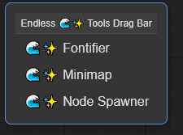

# Endless Sea of Stars Buttons

Some basic custom JavaScript files for the ComfyUI user interface. Features:

+ Spawner: adds multiple nodes at once, with collision detection to avoid placing over your current nodes
+ Miniamp: provides an overview of your workflow and allows for quick navigation to any node by clicking on it in the minimap
+ Fontifier: a script that allows you to change fonts and font sizes for ComfyUI nodes
+ More to come (maybe)

When using the [ComfyUI](https://github.com/comfyanonymous/ComfyUI) interface for AI art generation, I sometimes find that the standard nodes and the many custom nodes out there don't work the way I want them to, or how I think they should.

Rightly or wrongly, I was teaching myself a bit of Python back in 2023 to get some nodes up and running to do what I'd like, and I now I am doing the same for JavaScript. Yes, I am using ChatGPT, Copilot, Claude and others, and yes, I am a glutton for punishment. There are no promises that these scripts will work for you or that I will maintain them. Feel free to do with them as you wish, according to the license model.

***
**UPDATE: JUL 25, 2025**

+ Added the Endless 🌊✨ Node Spawner, which accesses your node library and allows you to select nodes to places
  + Categorizes your nodes based on the ComfyUI menu system
  + Places nodes with intelligent collision avoidance so it will not overlap existing ones
  + Real time search and filtering off nodes to add
+ Added the Endless 🌊✨ Minimap, which shows the current workflow landscape in a floating map
  + Colour coded nodes by category
  + Click on any node in the map to jump to it
  + Respects window aspect ratio
  + Places nodes with intelligent collision avoidance so it will not overlap existing ones
  + Real time search and filtering off nodes to add
+ Updated the Endless 🌊✨ Fontifier to allow for persistent state saving.

**UPDATE: JUL 20, 2025**

+ **Cloned the scripts from [Endless Sea of Stars Nodes](https://github.com/tusharbhutt/Endless-Nodes) so you can just download these scripts alone**
+ Added the Endless 🌊✨ Tools button to taskbar.  This acts as a centralized repository of all my scripts
+ Introduced the Endless 🌊✨ Fontifier, a script that allows you to dynamically change fonts and sizes.
  + No need to dive into CSS to change text size
  + Allows changes to the title areas, connector text, widgets, and more
  + Adjust the height of the title bar and other areas too, to accommodate the new font size

## Installation Instructions

It’s preferable to install from the ComfyUI Node Manager, but for direct installation, do this:

+ Navigate to your /ComfyUI/custom_nodes/ folder 
+ In Windows, you can then right-click to start a command prompt and type:

`git clone https://github.com/tusharbhutt/Endless-Buttons`

**NOTE: The scripts are also available as part of [Endless Sea of Stars Nodes](https://github.com/tusharbhutt/Endless-Nodes), which features a set of useful nodes**

If installed correctly, you should see a button in the main ComfyUI taskbar that look like this: 

Endless 🌊✨ Tools

and when you click it, a floating toolbar with available scripts will be enabled.  Dismiss the floating toolbar with the ESC key.  **DON'T SEE THE BUTTON IN THE TOOLBAR? PRESS CTRL-ALT-E TO BRING THE TOOLBAR**

***
## Assistance Requests

I am not a programmer, nor do I care to be.  I have a fulltime job that eats up 50-60 hours a week and I made these scripts for myself.   I’ve tested the scripts on my system and uploaded them as they seem to work. They may or may not work for you or on your system.  

If you have issues, ask me **nicely** for help. Your tone matters; I'm too old and tired to pay attention to people who think I blew up their machines, and if how I react to you if you are difficult bothers you, some self-reflection is in order on your part.  You are not "forthright" or "honest" or "direct", you're merely an ass if you think badgering people is justifiable to get what you want.  The world has too many assholes, don't make me think you're another one.
***

## Button List

 A helper script places a button on your task bar called "Endless 🌊✨ Tools":

**IF YOU DO NOT SEE IT, PRESS CTRL-ALT-E TO BRING UP A FLOATING TOOLBAR THAT CAN BE MOVED AROUND**  This is the central toolbar that contains all the scripts I have made for this collection.  Get rid of it by pressing the ESC key.

### Endless 🌊✨ Node Spawner

I find that sometimes I need to create a few nodes for a workflow and creating them one at a time is painful for me.  So, I made the Endless 🌊✨ Node Spawner. The spawner has a searchable, categorized interface that supports batch operations and maintains usage history for improved efficiency.  Click the Endless 🌊✨ Tools button to bring up the floating toolbar and you should see a choice for "🌊✨ Node Spawner". Clicking it shows the dialog box below: 

The node spawner has the following features:

+ Hierarchical categorization of all available nodes
+ Real-time search and filtering capabilities
+ Search history with dropdown suggestions
+ Batch node selection and spawning
+ Intelligent collision detection for node placement
+ Category-level selection controls
+ Persistent usage tracking and search history

Here's a quick overview of how to use the spawner:

+ Open the Node Loader from the Endless Tools menu
+ Browse categories or use the search filter to find specific nodes
+ Select nodes individually or use category selection buttons
+ Review selections in the counter display
+ Click Spawn Nodes to add selected nodes to your workflow
+ Recently used nodes appear as clickable chips for quick access

Once you have made your selections and applied them, all the nodes you created will appear.  How fast is it? My system can create 950 nodes in less than two seconds.

### Endless 🌊✨ Minimap

When you have large workflows, it can be hard to keep tack of everything on the screen.  The ComfyUI web interface does have a button to resize the nodes to your screen, but I thought a minimap would be of use to some people.  The minimap displays a scaled overview of all nodes with visual indicators for the current viewport and support for direct navigation.  Click the Endless 🌊✨ Tools button to bring up the floating toolbar and you should see a choice for "🌊✨ Minimap". Clicking it shows the dialog box below: 

The minimap has the following features:

+ Dynamic aspect ratio adjustment based on canvas dimensions
+ Real-time viewport highlighting with theme-aware colors
+ Interactive click-to-navigate functionality
+ Zoom and pan controls for detailed exploration
+ Color-coded node types with optional legend display
+ Responsive resizing based on window dimensions
+ Drag-and-drop repositioning of the minimap window

Drag the box around by clicking and holding the title.  To cancel, you can simply click outside the dialog box or press the escape key.  With this dialog box, you can do the following:

+ Use the minimap to understand your workflow's overall structure
+ Click anywhere on the minimap to jump to that location
+ Click a node to jump to the node
+ Use zoom controls (+/-) or mouse wheel for detailed viewing
+ Toggle the legend (🎨) to identify node types by color

The drag bar has the following icons:

The icons correspond to:

🎨 Toggle legend
▫ Zoom out
🏠 Reset zoom and pan
⬜ Zoom in
❌ Close minimap

When you zoom in to the minimap, you can see the labels of the nodes as well, like shown below.  The minimap should also change shape to respect the browser window shape, and works with ComfyUI themes.

### Endless 🌊✨ Fontifier

I always found it odd that in the early days of ComfyUI, you could not change the font size for various node elements.  Sure you could manually go into the CSS styling in a user file, but that is not user friendly.  Later versions have allowed you to change the widget text size, but that's it. Yes,  you can zoom in, but... now you've lost your larger view of the workflow. If you have a 4K monitor and old eyes, too bad so sad for you. Click the Endless 🌊✨ Tools button to bring up the floating toolbar and you should see a choice for "🌊✨ Fontifier". Clicking it shows the dialog box below:

Drag the box around by clicking and holding the title.  To cancel, you can simply click outside the dialog box or press the escape key.  With this dialog box, you can do the following:

+ Globally change the font size for all text elements
+ Change the fonts themselves
+ Instead of a global change, select various elements to resize
+ Adjust the height of the title bar or connectors and other input areas
+ Save the current state for persistent use, or revert to ComfyUI defaults

Once you make your changes, you can preview them and then choose to apply or cancel.  Changed your mind?  Load the box again and press the reset key.  You can also save your settings for persistent use.

***
## Usage License and Restrictions

See [GPL Licensing V3](https://www.gnu.org/licenses/gpl-3.0.en.html#license-text) for usage. You may modify this code as long as you keep the credits for this repository and for those noted in the credit section below. **YOU ARE EXPRESSLY FORBIDDEN FROM USING THESE SCRIPTS TO CREATE ANY IMAGES OR ARTWORK THAT VIOLATES THE STABLE DIFFUSION [ACCEPTABLE USE POLICY](https://stability.ai/use-policy) OR THE USAGE POLICY FROM [BLACK FOREST LABS](https://bfl.ai/legal/usage-policy).**

For example, don't be a mouth-breather who creates fake nudes or sexual content of **anyone, even if you have their consent**. JUST. DON’T. BE. AN. ASSHOLE.  I call this my "Don't Be an Asshole™" licensing model  (I'm kidding about the trademark but not about the message).

The author expressly disclaims any liability for any images you create using these nodes.
***
## Disclaimer

These scripts may or may not be maintained. They work on my system but may not on yours. Feel free to send in a bug report if you find one! 
***
## Credits

+ Inspiration for the Fontifier came from having old eyes and a 4K screen
+ Anthropic Claude and OpenAI ChatGPT are actively used for coding creation/assistance
+ Thanks to all the node and script creators out there, most who toil away with little or no appreciation

#