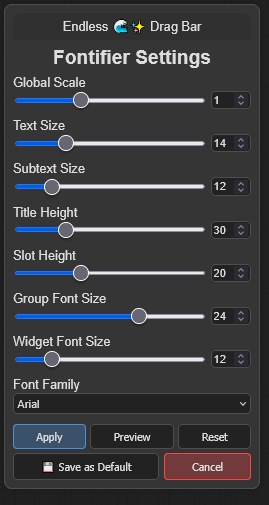

# Endless Sea of Stars Buttons

Some basic custom JavaScript files for the ComfyUI user interface. Features:

+ Fontifier: a script that allows you to change fonts and font sizes for ComfyUI nodes
+ More to come (maybe)

When using the [ComfyUI](https://github.com/comfyanonymous/ComfyUI) interface for AI art generation, I sometimes find that the standard nodes and the many custom nodes out there don't work the way I want them to, or how I think they should.

Rightly or wrongly, I was teaching myself a bit of Python back in 2023 to get some nodes up and running to do what I'd like, and I now I am doing the same for JavaScript. Yes, I am using ChatGPT, Copilot, Claude and others, and yes, I am a glutton for punishment. There are no promises that these scripts will work for you or that I will maintain them. Feel free to do with them as you wish, according to the license model.

***
**UPDATE: JUL 20, 2025**

+ **Cloned the scripts from [Endless Sea of Stars Nodes](https://github.com/tusharbhutt/Endless-Nodes) so you can just download the scripts if you want**
+ Introduced the Endless 🌊✨ Fontifier, a little button on your taskbar that allows you to dynamically change fonts and sizes.
  + No need to dive into CSS to change text size
  + Allows changes to the title areas, connector text, widgets, and more
  + Adjust the height of the title bar and other areas too, to accommodate the new font size

## Installation Instructions

It’s preferable to install from the ComfyUI Node Manager, but for direct installation, do this:

+ Navigate to your /ComfyUI/custom_nodes/ folder 
+ In Windows, you can then right-click to start a command prompt and type:

`git clone https://github.com/tusharbhutt/Endless-Buttons`

If installed correctly, you should see a menu choice in the main ComfyUI menu that look like this: 

Endless 🌊✨ Tools

and when you click it, a floating toolbar with available scripts will be enabled.  **DON'T SEE THE BUTTON IN THE TOOLBAR? PRESS CTRL-ALT-E**

***
## Assistance Requests

I am not a programmer, nor do I care to be.  I have a fulltime job that eats up 50-60 hours a week and I made these scripts for myself.   I’ve tested the scripts on my system and uploaded them as they seem to work. They may or may not work for you or on your system.  

If you have issues, ask me **nicely** for help. Your tone matters; I'm too old and tired to pay attention to people who think I blew up their machines, and if how I react to you if you are difficult bothers you, some self-reflection is in order on your part.  You are not "forthright" or "honest" or "direct", you're merely an ass if you think badgering people is justifiable to get what you want.  The world has too many assholes, don't make me think you're another one. ™
***

## Button List

### Endless 🌊✨ Fontifier

I always found it odd that in the early days of ComfyUI, you could not change the font size for various node elements.  Sure you could manually go into the CSS styling in a user file, but that is not user friendly.  Later versions have allowed you to change the widget text size, but that's it. Yes,  you can zoom in, but... now you've lost your larger view of the workflow. If you have a 4K monitor and old eyes, too bad so sad for you.  This javacsript places a button on your task bar called "Endless 🌊✨ Fontifier".  Clicking it shows the dialog box below:

Drag the box aronud by clicking and holding the title.  To cancel, you can simply click outside the dialog box or press the escape key.  With this dialog box, you can do the following:

+ Globally change the font size for all text elements
+ Change the fonts themselves
+ Instead of a global change, select various elements to resize
+ Adjust the higher of the title bar or connectors and other input areas

Once you make your changes, you can preview them and then choose to apply or cancel.  Changed your mind?  Load the box again and press the reset key.

***
## Usage License and Restrictions

See [GPL Licensing V3](https://www.gnu.org/licenses/gpl-3.0.en.html#license-text) for usage. You may modify this code as long as you keep the credits for this repository and for those noted in the credit section below. **YOU ARE EXPRESSLY FORBIDDEN FROM USING THESE SCRIPTS TO CREATE ANY IMAGES OR ARTWORK THAT VIOLATES THE STABLE DIFFUSION [ACCEPTABLE USE POLICY](https://stability.ai/use-policy) OR THE USAGE POLICY FROM [BLACK FOREST LABS](https://bfl.ai/legal/usage-policy).**

For example, don't be a mouth-breather who creates fake nudes or sexual content of **anyone, even if you have their consent**. JUST. DON’T. BE. AN. ASSHOLE.  I call this my "Don't Be an Asshole™" licensing model  (I'm kidding about the trademark but not about the message).

The author expressly disclaims any liability for any images you create using these nodes.
***
## Disclaimer

These scripts may or may not be maintained. They work on my system but may not on yours. Feel free to send in a bug report if you find one! 
***
## Credits

+ Inspiration for the Fontifier came from having old eyes and a 4K screen
+ Anthropic Claude and OpenAI ChatGPT are actively used for coding creation/assistance
+ Thanks to all the node and script creators out there, most who toil away with little or no appreciation

#